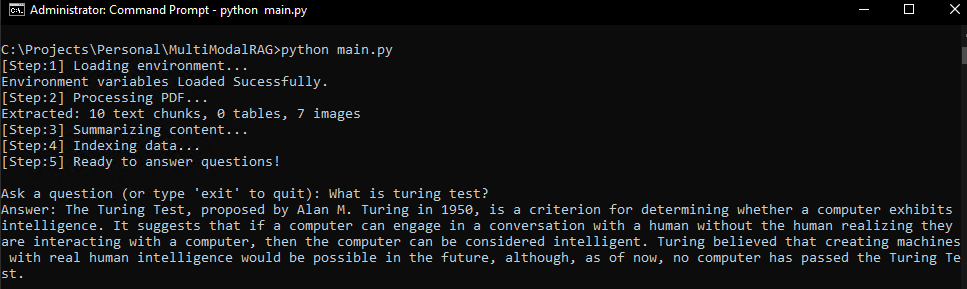
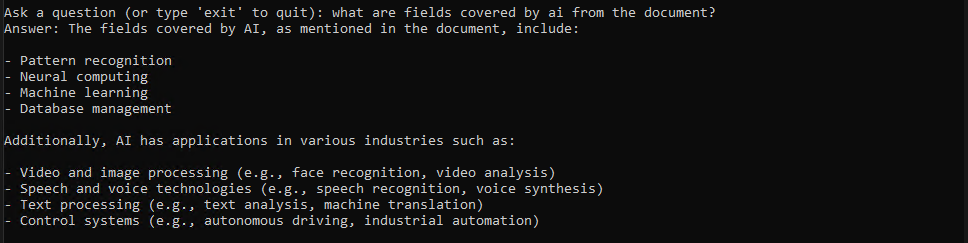

# Multimodal RAG: Chat with Your PDF (Images + Tables + Text)

This mini project implements a **Multimodal Retrieval-Augmented Generation (RAG)** pipeline that allows you to **ask questions about PDFs** containing **text, tables, and images**. It extracts content from a document, summarizes it, indexes it, and answers user queries using a language model combining retrieval with generation for context-aware answers.

It combines powerful LLMs from OpenAI and Groq, with vector-based semantic retrieval using ChromaDB, enabling rich document comprehension and interactive Q&A.

## What Purpose does it solves:
Given a PDF document (like a research paper or business report), this pipeline:

1. **Parses** the PDF into text chunks, tables, and images.
2. **Summarizes** each extracted component using LLMs.
3. **Indexes** summaries into a multi-vector retriever.
4. **Allows querying** across all formats (text, tables, images).
5. **Responds** with a coherent answer grounded in the document content.

## Tech Powering this workflow:

- **LangChain**: Framework for chaining LLMs and tools.
- **OpenAI / Groq**: LLMs for summarization and answering.
- **Unstructured**: PDF parsing with support for tables and images.
- **ChromaDB**: Vector store for retrieval.
- **Python 3.10+**

## Project Structure
```
    └── 📁content
        └── drylab.pdf
    └── .env
    └── env_setup.py
    └── main.py
    └── pdf_processing.py
    └── query_chain.py
    └── rag_indexing.py
    └── Readme.md
    └── requirements.txt
    └── summarize_chunks.py
```

## How it works:

### Step 1: Load Environment

- Loads API keys from `.env` file using `dotenv`.
- Enables LangChain tracing with:
```python
os.environ["LANGCHAIN_TRACING_V2"] = "true"
```
---

### Step 2: Parse PDF Content

- Uses `unstructured.partition.pdf` to extract:
  - **Text blocks** as structured elements.
  - **Tables** as HTML-like strings.
  - **Images** as base64-encoded JPEGs.
- Applies high-resolution parsing with:

---

### Step 3: Summarize Chunks

- Uses LLMs to summarize content by type:
  - **Text and Tables**: summarized using Groq’s `llama-3.1-8b-instant`.
  - **Images**: described using OpenAI’s `gpt-4o-mini` with base64 input.
- Summarization is batched for performance:

---

### Step 4: Build Retriever

- Summaries are embedded using `OpenAIEmbeddings`.
- Data is indexed with:
  - **Vector store**: `Chroma`
  - **Doc store**: `InMemoryStore`
- Multi-vector retriever links summaries to original data:
```python
retriever = MultiVectorRetriever( vectorstore=vectorstore, docstore=store, id_key="doc_id" )
```

---

### Step 5: Ask Questions

- User inputs a natural language query.
- The retriever fetches related content across:
  - Text
  - Tables
  - Images
- The final response is generated by `gpt-4o-mini` using all modalities as context:

## Getting Started

Follow these steps to set up and run the project locally.

---

### Prerequisites
- Python 3.10 or higher
- `pip` for package management
- API keys from:
  - [OpenAI](https://platform.openai.com/account/api-keys)
  - [Groq](https://console.groq.com/keys)

### What is Groq?

[Groq](https://groq.com/) provides ultra-fast inference for large language models, enabling real-time performance for tasks like summarization, generation, and reasoning. In this project, Groq is used to **summarize text and table content** using the `llama-3.1-8b-instant` model.

Groq models are accessible via an API (similar to OpenAI), and require an API key.

---

### How to Get Your Groq API Key

1. Visit [https://console.groq.com](https://console.groq.com)
2. Sign up or log in
3. Go to the **"API Keys"** tab in the dashboard
4. Click **"Create API Key"**
5. Name it (e.g., `multimodal-rag`) and click **Create**
6. Copy the key you'll use it in the `.env` file

---

### 1. Clone the Repository

```bash
git clone https://github.com/aman-panjwani/multimodal-rag-llm.git
cd multimodal-rag
```

### 2. Create a Virtual Environment
It's good practice to isolate dependencies in a virtual environment.
```bash
python -m venv venv
source venv/bin/activate       # For macOS/Linux
venv\Scripts\activate          # For Windows
```

### 3. Install Dependencies
Install all required Python packages:
```bash
pip install -r requirements.txt
```

### 4. Set Up Environment Variables
Create a `.env` file in the project root and add the following:
```.env
OPENAI_API_KEY=your-openai-api-key
GROQ_API_KEY=your-groq-api-key
```

### 5. Place Your PDF
By default, the pipeline looks for this file:
```
content/drylab.pdf
```
You can replace it with your own file (make sure it’s named the same or update the path in `pdf_processing.py`).

### 6. Run the Pipeline
Execute the main script:
```
python main.py
```

## Results & Screenshots

Below are a few screenshots showcasing how the pipeline works and how responses are generated from multimodal PDF content.

---

### Prompt

> **Question:** What is Turing Test?

### Response



---

### Prompt

> **Question:** What are fields covered by AI from the document?

### Response



---


## Tips & Best Practices


- **Replace the default PDF** with your own content in the `content/` folder to explore different document types.
- **Edit the default question** in `main.py` or use the interactive loop to query freely.
- **Customize chunking behavior** in `pdf_processing.py` by tweaking parameters like `chunking_strategy`, `max_characters`, etc.
- **Experiment with other LLMs** by swapping model names in `summarize_chunks.py` or `query_chain.py`.
- **Use GPU-backed endpoints** from Groq or OpenAI for better performance with larger documents.
- **Test incrementally** with smaller PDFs before moving to large academic papers or reports.

---

## Conclusion

This mini but amazing project demonstrates the power of combining **multimodal document understanding** with modern **LLM-powered Retrieval-Augmented Generation (RAG)**.

By leveraging tools like **LangChain**, **Groq**, **OpenAI**, and **Unstructured**, this pipeline can parse PDFs containing a mix of text, tables, and images — and generate intelligent, grounded answers to natural language queries.

It's a flexible, extendable base for building document Q&A tools, research assistants, or domain-specific copilots.


Feel free to fork, customize, and expand this project to suit your specific use case!